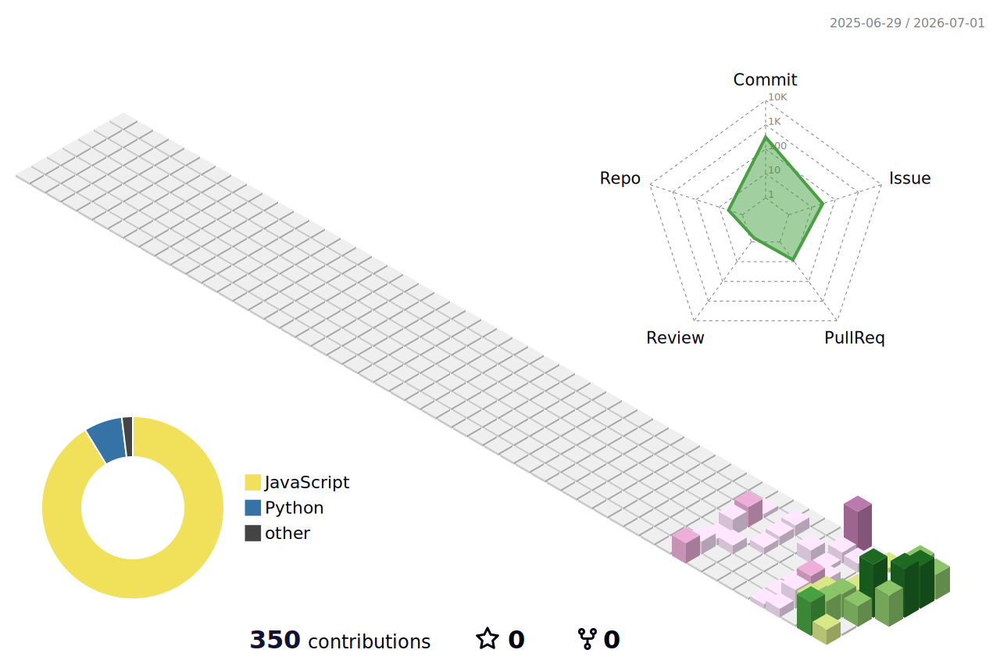

<picture>
  <source
    media="(prefers-color-scheme: dark)"
    srcset="./profile-3d-contrib/profile-night-view.svg"
  />
  
</picture>

 

Not a résumé. A terrain of accumulated changes.

 

## Workbench

<picture>
  <source
    media="(prefers-color-scheme: dark)"
    srcset="https://skillicons.dev/icons?i=dotnet,cs,github,grafana,docker,vscode&theme=dark"
  />
  
</picture>

