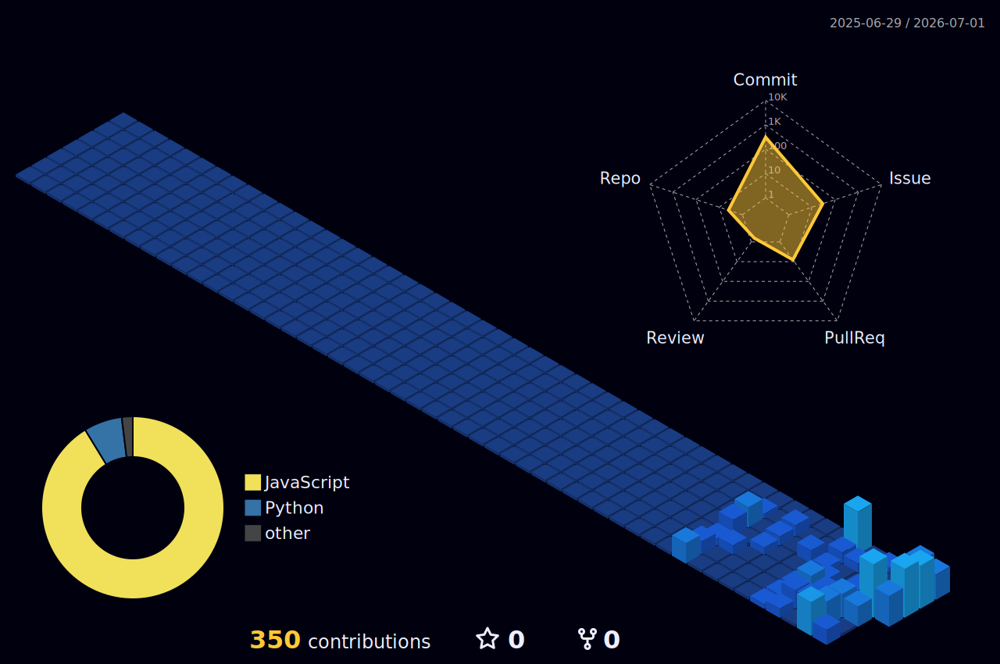

  

  

 

  

 

<table align="center">
  <tr>
    <td width="33%" align="center" valign="top" bgcolor="#161B22">
       
      <h3>cultivate</h3>
      
Small changes, accumulated over time.

       
    </td>
    <td width="12">&nbsp;</td>
    <td width="33%" align="center" valign="top" bgcolor="#161B22">
       
      <h3>observe</h3>
      
Signals before conclusions.

       
    </td>
    <td width="12">&nbsp;</td>
    <td width="33%" align="center" valign="top" bgcolor="#161B22">
       
      <h3>shape</h3>
      
Systems that become easier to reason about.

       
    </td>
  </tr>
</table>

 

## Tech Stack

  

 

<b>Design Principles</b>

 

<table align="center">
  <tr bgcolor="#161B22">
    <td align="center" width="48%"><b>Principle</b></td>
    <td align="center" width="52%"><b>Meaning</b></td>
  </tr>
  <tr>
    <td>Design serves the product</td>
    <td>Form follows function. Design decisions are driven by product goals, not decoration.</td>
  </tr>
  <tr>
    <td>Human-in-the-loop by default</td>
    <td>AI augments — it does not replace. Every automated action has a review surface.</td>
  </tr>
  <tr>
    <td>Observable before automated</td>
    <td>You cannot improve what you cannot see. Metrics, traces, and logs precede optimization.</td>
  </tr>
  <tr>
    <td>Documentation is part of the product</td>
    <td>Intent, context, and rationale are first-class deliverables — not afterthoughts.</td>
  </tr>
</table>

 

<b>GitHub Metrics</b>

 

  
  

 

 

  

 

  

